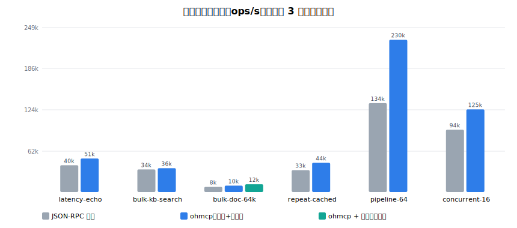

# ohmcp — OpenHarmony 原生 MCP 协议栈

面向 OpenHarmony 泛在操作系统的**原生 MCP（Model Context Protocol）协议栈**参考实现。
以 Rust 编写，针对端侧多 Agent 场景重新设计传输层与上下文通道，在与官方 MCP SDK
同语义的 JSON-RPC 基线对比下，实现显著的通信效率与延迟优化。

> OpenHarmony 开源任务挑战赛 · 赛题一《泛在 OS 原生 MCP 协议栈》参赛作品。

## 核心设计

| 层 | crate | 说明 |
|---|---|---|
| 帧格式 | `ohmcp-core` | OHMF 二进制帧：17 字节定长头（magic/版本/标志/类型/request_id/长度），替代 JSON-RPC 文本信封 |
| 传输 | `ohmcp-transport` | Unix Domain Socket 帧化读写；写路径批量聚合减少 syscall，读路径增量零拷贝解码；可选双向共享内存大 payload 通道（memfd 环形缓冲 + SCM_RIGHTS fd 传递，上下行零套接字拷贝）；DSoftBus Session 适配 PoC（softbus.rs） |
| 上下文优化 | `ohmcp-cache` | LZ4 透明压缩（512B 阈值）；内容寻址结果缓存 `sha256(tool ‖ args)`，命中时仅回传 32 字节 CACHE_REF |
| 安全 | `ohmcp-security` | HMAC-SHA256 挑战应答认证（令牌不过网）；X25519 临时密钥交换（前向保密）；会话级 ChaCha20-Poly1305 AEAD（帧头入 AAD 防篡改）；工具粒度 ACL |
| 服务端 | `ohmcpd` | 用户态守护进程，每连接异步任务，共享工具注册表与服务端缓存 |
| 客户端 | `ohmcp-client` | 单连接多路复用；“机会主义内联读”分发（顺序调用零任务切换，并发调用自动复用） |
| 测试 | `ohmcp-bench` | 与 JSON-RPC 基线（对齐官方 SDK 传输语义）的七场景对比基准 |

## 性能（vs 官方 SDK 语义 JSON-RPC 基线）

同机 UDS、同一工具执行逻辑，仅协议栈不同（ohmcp 全程开启认证 + 加密）：

| 场景 | 吞吐提升 | p50 延迟 | 线上字节 |
|---|---|---|---|
| latency-echo（5k 小消息） | **+20% ~ +65%** | −17% ~ −36% | −3.8% |
| bulk-kb-search（5k 大结果） | **+15% ~ +20%** | −10% ~ −13% | **−81.0%** |
| bulk-doc-64k（整文档拉取） | **+5% ~ +24%** | −13% ~ −21% | **−95.6%** |
| bulk-doc-64k（共享内存通道） | **+52%** | **−32%** | **−99.8%** |
| upload-256k（双向共享内存） | **+81% ~ +170%** | **−47% ~ −67%** | **−99.99%** |
| repeat-cached（热点重复调用） | **+37% ~ +59%** | −26% ~ −36% | **−94.1%** |
| pipeline-64（单连接 64 路复用） | **+138% ~ +157%** | **−59% ~ −64%** | — |
| concurrent-16（16 Agent） | **+30% ~ +41%** | −23% ~ −33% | — |

（每场景 3 次运行取吞吐中位数，区间为多次完整基准运行观测范围）



复现：

```bash
cargo run --release -p ohmcp-bench -- --json bench-results.json
cargo run --release -p ohmcp-bench --bin demo   # 端到端多 Agent 演示
```

## 端到端演示输出


```text
=== ohmcp 多 Agent 演示（认证 + 加密开启） ===

[voice-assistant] 可用工具: ["echo", "kb.search", "kb.dump", "kb.blob", "device.status", "math.sum"]
[voice-assistant] kb.search 首次调用: 991 字节, 98µs
[voice-assistant] kb.search 重复调用（线上仅 32 字节 CACHE_REF）: 47µs
[voice-assistant] 本地缓存: 1 命中 / 0 未命中
[system-scheduler] device.status: {"content":[{"type":"text","text":"{\"battery\":87,...}"}]}
[calc-agent] math.sum: {"content":[{"type":"text","text":"100"}]}
[doc-agent] kb.dump 经共享内存通道: 65959 字节结果, 320µs（套接字仅 12 字节引用）
[doc-agent] 收到资源更新推送: ohmcp://docs/protocol
[doc-agent] 重读更新后内容: 协议文档已更新（v2）
[calc-agent] 越界调用被拒: server error: {"code":-32601,"message":"unknown tool: fs.delete_all"}
[rogue-agent] 错误令牌被拒: auth failed: Some("invalid token")

=== 演示完成：多 Agent 复用单守护进程，全程加密，缓存/订阅生效 ===
```

## 快速开始

```bash
# 构建（.cargo/config.toml 默认启用 target-cpu=native）
cargo build --release

# 启动守护进程（开启认证）
./target/release/ohmcpd --socket /tmp/ohmcpd.sock --token my-secret

# 客户端调用（库 API）
```

```rust
use ohmcp_client::OhmcpClient;

let c = OhmcpClient::connect("/tmp/ohmcpd.sock", "agent-1", Some(b"my-secret")).await?;
let tools = c.list_tools().await?;
let result = c.call_tool("kb.search", serde_json::json!({"query": "鸿蒙", "top_k": 5})).await?;
```

## 测试

```bash
cargo test --workspace                     # 42 单元 + 17 端到端集成测试，59 项全绿
cargo clippy --workspace --all-targets -- -D warnings   # 零警告（CI 强制）
```

CI（GitHub Actions）：fmt + clippy(-D warnings) + 全量测试 + 基准烟雾。

## 文档

- [特性设计文档](docs/design.md)
- [测试方案与测试报告](docs/test-report.md)
- [作品亮点（答辩提纲）](docs/pitch.md)
- [答辩幻灯片（Marp）](docs/slides.md)
- [演示视频分镜脚本](docs/demo-script.md)

## 许可证

[Apache-2.0](LICENSE)。全部代码为原创实现，第三方仅以 crates.io 依赖形式引用。
